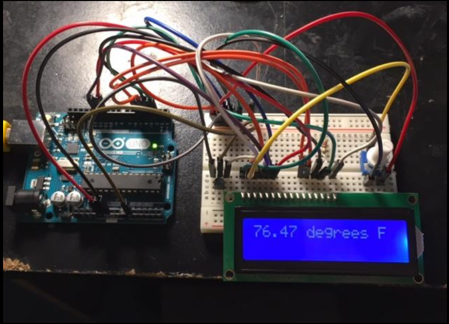

# 🌡️ Temperature-Based Fan Speed Controller with LCD Telemetry

## 1. Project Overview

This project implements an automated, **closed-loop thermal management system** using an **Arduino Uno**. The system dynamically regulates the rotational speed of a DC cooling fan based on real-time ambient temperature data sampled at **1 Hz**. It utilizes **Pulse Width Modulation (PWM)** for high-efficiency speed transitions and includes a **16x2 LCD** for live telemetry.

---

## 2. Technical Specifications

| Category | Component / Parameter | Specification / Detail |
| :--- | :--- | :--- |
| **Microcontroller** | Arduino Uno | ATmega328P |
| **Temperature Sensor** | LM35 / TMP36 | Precision Analog Sensing (±0.5°C accuracy) |
| **Display Interface** | 16x2 Parallel LCD | Hitachi HD44780 Compatible |
| **Actuator** | DC Cooling Fan | 12V operation via Relay/MOSFET |
| **Control Logic** | PWM & Thresholding | Closed-loop proportional control |

---

## 3. System Architecture & Visuals

The hardware integration and system response are documented below for immediate technical context.

### 🔹 Hardware Integration



*Figure 1: Integrated hardware assembly showing Arduino controller, sensor interface, and fan module.*

---

## 4. Working Principle

1. **Data Acquisition** — The system samples analog voltage signals from the temperature sensor and converts them into a calibrated Celsius reading.
2. **Logic Processing** — If the detected temperature exceeds a pre-set threshold (e.g., 30°C), the Arduino either activates the fan via a relay or modulates the PWM duty cycle for variable speed control.
3. **Telemetry Interface** — The 16x2 LCD provides continuous user feedback, displaying live thermal data and the active fan status.

---

## 5. Repository Structure

```
├── /code         → fan_controller_lcd.ino  (sensing, LCD driving, and PWM logic)
├── /schematics   → Circuit wiring diagrams and Bill of Materials (BOM)
└── /visuals      → High-resolution project photography and demonstration video
```

---

**License:** This project is released under the **MIT License**.
